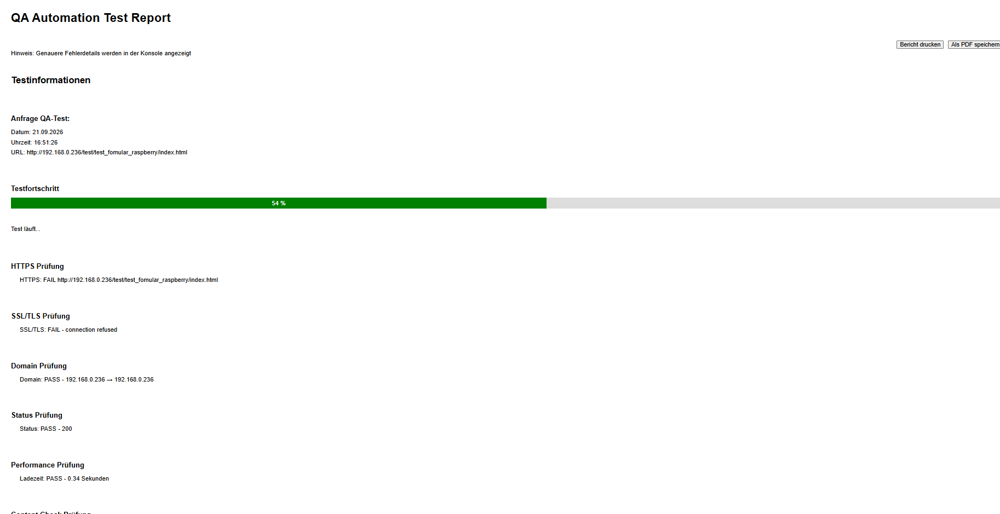
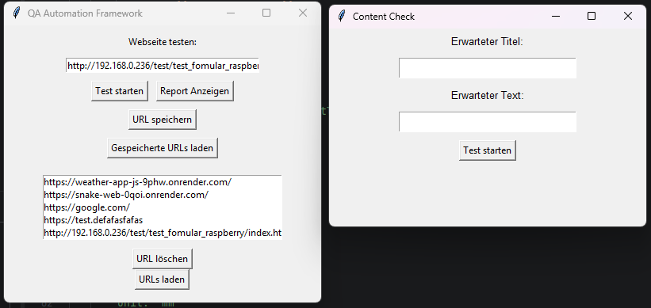
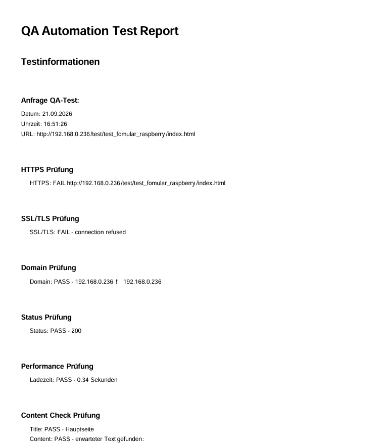

# QA Automation Framework

Ein selbst entwickeltes Python-Framework zur automatisierten Prüfung von Websites.
Das Framework führt verschiedene HTTP-, HTML- und Browser-Tests durch und überprüft dabei sowohl technische Eigenschaften als auch die Funktionalität einer Website.

## Funktionen
### HTTP- und Website-Tests

- HTTPS-Prüfung
- SSL/TLS-Prüfung
- Domain-Prüfung
- HTTP-Statuscode
- Ladezeit
- Title-Prüfung
- Content-Prüfung
- Broken Links
- Bilder und Dateien
- HTML-Struktur
- Sprache
- HEAD und BODY
- Überschriften
- Charset
- Viewport
- Mobile Darstellung
- Meta Description
- Robots

### Browser-Tests

Für die Browser-Tests wird Playwright verwendet.

- Buttons erkennen und testen
- aufklappbare Buttons testen
- neu erscheinende Buttons testen
- interaktive Elemente testen
- interaktive Unterelemente testen
- Navigation zu Zielseiten prüfen
- Formulare über Buttons erkennen
- Formulare über Links erkennen
- Eingabefelder prüfen
- Eingabefelder auf Beschreibbarkeit prüfen
- Formulare absenden
- Select-Felder prüfen
- Auswahloptionen testen

## HTML-Testbericht

Während des Testlaufs wird automatisch ein HTML-Testbericht erstellt.
Die Testergebnisse werden von Python in HTML-Code eingesetzt und anschließend in der Datei qa_test_report.html gespeichert.
Der erzeugte Bericht kann anschließend im Browser geöffnet werden und zeigt den aktuellen Teststand und die Testergebnisse übersichtlich an.

Die Datei qa_test_report.html kann in einem beliebigen Browser geöffnet werden:
qa_test_report.html auswählen → Rechtsklick → Öffnen mit → gewünschten Browser auswählen.



## Verwendete Technologien

- Python
  - webbrowser
  - Tkinter
  - time
  - ssl
  - socket
  - os
  - threading
- Requests
- Playwright
- HTML
- CSS
- JavaScript
- PHP (Testseite/Testformulare)

## Installation

1. Repository klonen und in das Projektverzeichnis wechseln.
2. Anschließend die benötigten Python-Pakete installieren: ```bash pip install -r requirements.txt ```
   Benötigte Playwright-Browser installieren: ```bash playwright install```
3. Framework starten: ```bash python main.py```

## Verwendung
Die zu prüfende URL kann in das obere Eingabefeld eingetragen werden.
Über den Button „Test starten“ wird der Testlauf gestartet.
Während des Testlaufs bleibt die GUI bedienbar und der aktuelle Testbericht kann über „Report anzeigen“ geöffnet werden.
Gespeicherte URLs können über die entsprechenden Buttons geladen, gespeichert, ausgewählt und gelöscht werden.
Nach dem Testlauf wird automatisch der HTML-Testbericht erstellt.

Über den Button „PDF exportieren“ kann der Testbericht zusätzlich als PDF gespeichert werden.
Die PDF-Datei wird automatisch im Downloads-Ordner als `qa_test_report.pdf` gespeichert.




## Projektstruktur
### Zentrale Dateien

- main.py – Startpunkt des Frameworks
- gui.py – grafische Benutzeroberfläche
- test_runner.py – Durchführung der automatisierten Tests und Erstellung des Testberichts
- url_manager.py – Laden, Speichern und Löschen der zu prüfenden URLs
- url_list.txt – gespeicherte URLs
- qa_test_report.html – automatisch erzeugter HTML-Testbericht
- qa_test_report.css – Gestaltung des HTML-Testberichts
- requirements.txt – benötigte Python-Abhängigkeiten
- docs/cheatsheet.txt – hilfreiche Notizen und Befehle

### Testumgebung für den QA-Test

- Test_Formulare_Raspberry
  - Testseiten
  - Testformulare für die Browser- und Funktionstests

## Testseite

Für die Entwicklung und zum Testen des Frameworks wurde eine eigene Testseite erstellt.
Diese enthält unter anderem:

- verschiedene Buttons
- Untermenüs
- interaktive Elemente
- Formulare
- Eingabefelder
- Select-Felder
- Auswahloptionen
- verschiedene Links und Zielseiten

Dadurch können die Browser- und Funktionstests mit kontrollierten Testfällen entwickelt und überprüft werden.

## Testbericht Druck/PDF

Der vorhandene HTML-Testbericht kann direkt aus dem Browser heraus gedruckt werden.
Zusätzlich bietet das Framework einen PDF-Export über Playwright.
Beim PDF-Export wird der vorhandene HTML-Testbericht mit Chromium geladen und als PDF im A4-Format erstellt.
Die erzeugte Datei wird automatisch im Downloads-Ordner als `qa_test_report.pdf` gespeichert.

